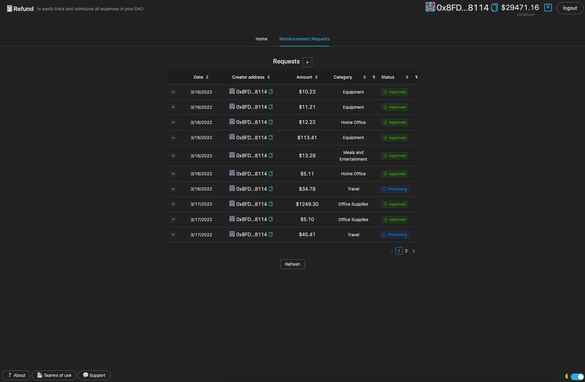
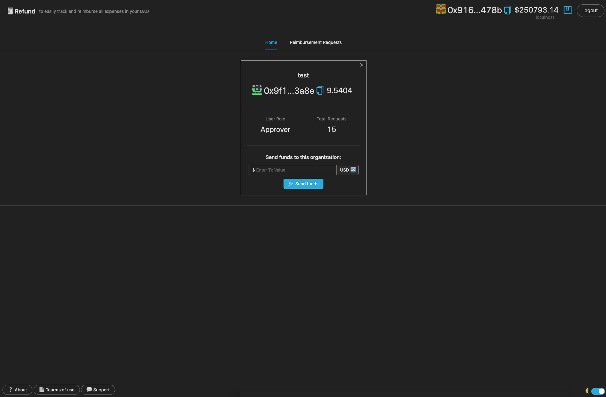
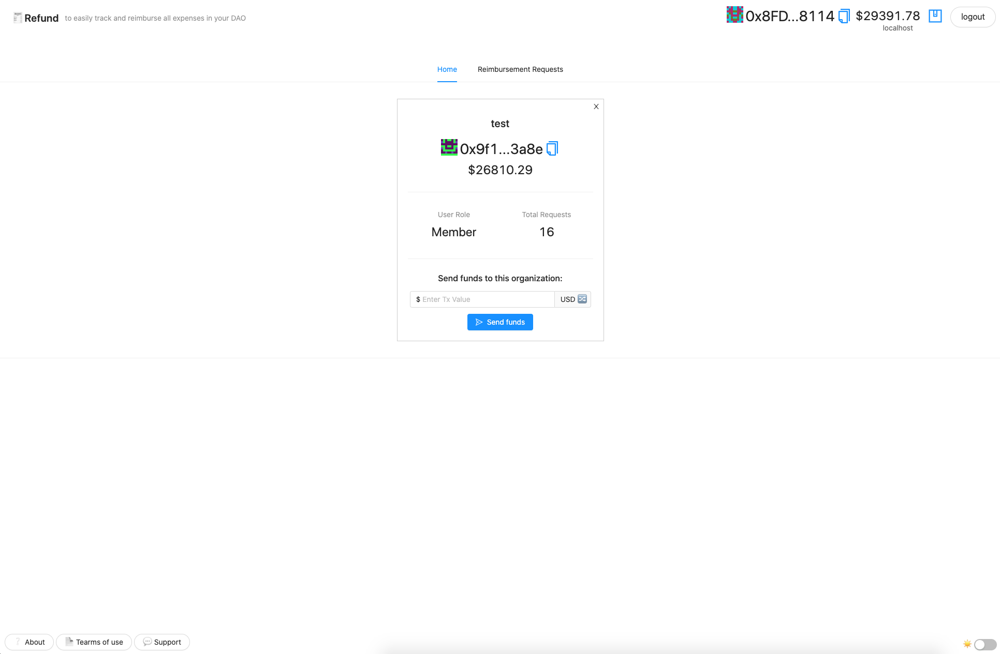
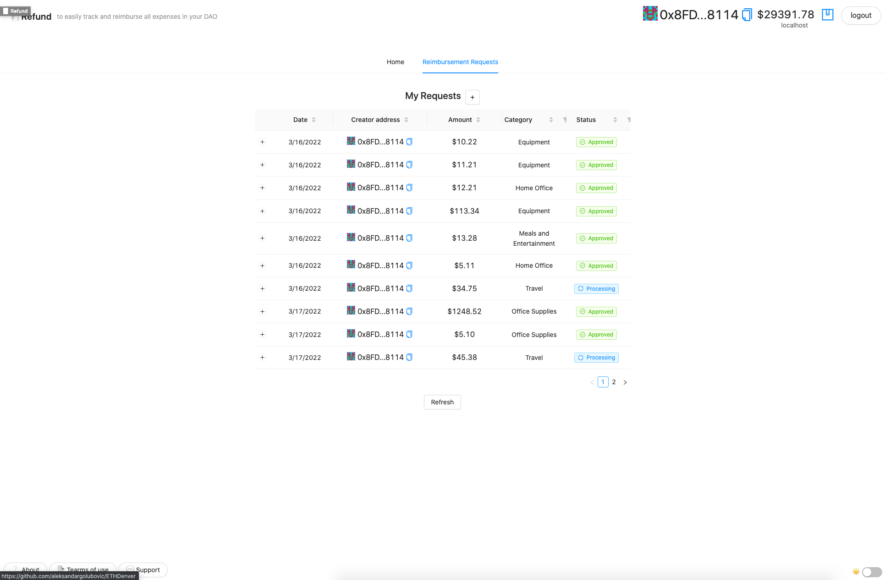
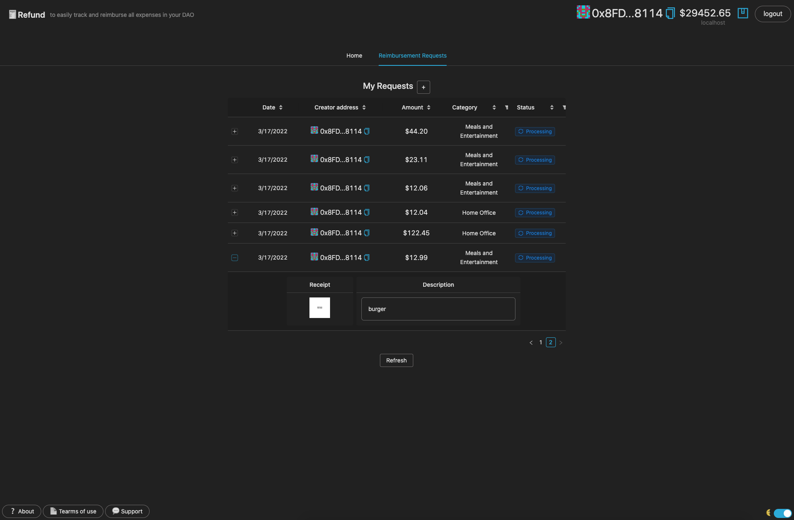
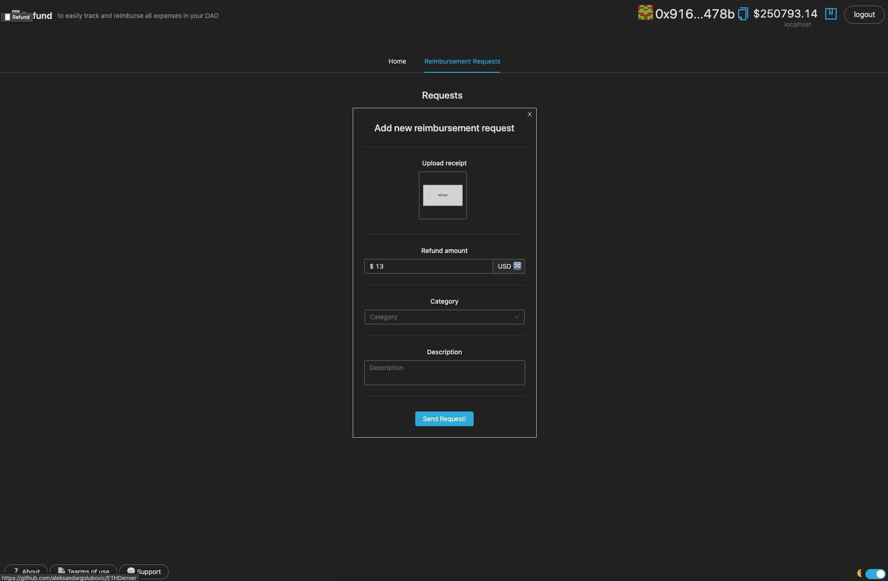

# REFUND - to easily track and reimburse all expenses in your DAO

</img> </img> </img> </img> </img> </img> 

## Project Overview
A project developed for ETH Denver Virtual Hackathon.  
Refund is a web3 app which makes easier to track and reimburse all the expenses in your DAO.  
Refund is an expense management system for DAOs (Decentralized Autonomous Organizations). The app tracks and files expenses such as fuel, travel, and meals.  
Once users photograph receipts, the photos are uploaded and stored on a distributed storage using IPFS and Web3.Storage.  
Artificial intelligence identifies the amount of the transaction, then user categorizes and saves the expense.  
It also allows users to upload receipts from online purchases that can be submitted for reimbursement.  
Once approved, the amount of the reimbursement request gets automatically sent from DAO's wallet to the user who created the request.  
Refund allows users to see all expense reports based on user transactions.  
On organization creation, a user roles have to be assigned.  
Inside Refund, a member of a DAO can be registered either as an **Approver**, which gives the power to approve or deny expenses,  
or a **Member** role, which represents a regular member who can create a new reimbursement requests.  


## Technologies
* React
* Solidity

## Project developed with
* [Metis](https://docs.metis.io/)
* [Hardhat](https://hardhat.org/)
* [IPFS](https://ipfs.io/)
* [Web3.Storage](https://web3.storage/)

## Quick start

### Prerequisites
* [Node 12+](https://nodejs.org/en/download/)
* [Yarn](https://classic.yarnpkg.com/en/docs/install/)
* [Metamask wallet](https://chrome.google.com/webstore/detail/metamask/nkbihfbeogaeaoehlefnkodbefgpgknn) - wallet should have [Metis Stardust Testnet](https://docs.metis.io/building-on-metis/connection-details) network configured

### How to run

- Go to /refund/packages/hardhat/ and rename .env.example to .env and provide your wallet PRIVATE_KEY
- Compile and deploy contracts using Hardhat by running the following commands:
```
    yarn install
    yarn deploy --network metis
```
- Start frontend
```
    yarn install
    yarn start
```
- Open http://localhost:3000 to see the app

## Demo

## Team Members
- github@aleksandargolubovic, software developer
- github@dzoni-hash, software developer

## Future work/TODO
* Implement mobile version of the app
* Improve receipts images recognition
* Enhance the UI and UX
* Add new options
